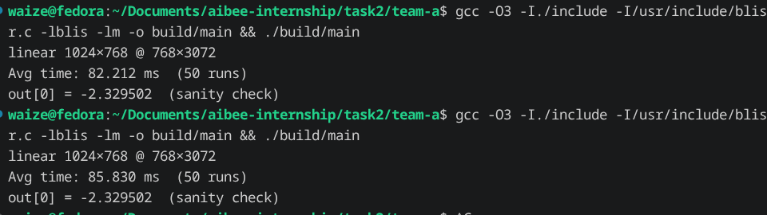

# Team A — GPT-2 Transformer Block

## Linear Kernel — M. Waize

### What It Does

The `linear` function computes a fully-connected (dense) layer:

```
output = x · W + b
```

This is the most-called function in the entire GPT-2 transformer block — it's used for Q/K/V projections, the output projection after attention, and both layers of the MLP. In one block alone, `linear` is called **6 times**.

### Project Structure

```
team-a/
├── include/kernels/
│   └── linear.h           ← function declaration + documentation
├── source/kernels/
│   ├── linear.c           ← implementation using BLIS sgemm
│   └── main.c             ← benchmark program
├── tests/
│   └── linear.py          ← answer-key test (compares C output vs PyTorch)
└── Makefile
```

### How It Works

The function uses **BLIS** (BLAS-like Library Instantiation Software) for the matrix multiply. Here's what happens step by step:

1. **Wrap inputs as BLIS objects** — BLIS doesn't take raw float pointers. Instead, you create `obj_t` descriptors that tell BLIS the matrix dimensions and memory layout (row-major strides).

2. **Handle transposition** — Sometimes the weight matrix `W` is stored transposed. Instead of physically transposing the data (expensive — would copy millions of floats), we tell BLIS to treat it as transposed using `bli_obj_set_conjtrans(BLIS_TRANSPOSE, &B)`. BLIS reads it transposed during the multiply — zero extra memory, zero copies.

3. **Matrix multiply** — `bli_gemm` computes `C = alpha * A * B + beta * C`. We set `alpha = 1.0` and `beta` depends on the bias strategy (see below).

4. **Add bias** — The bias vector `b` gets added to every row of the output.

### Function Signature

```c
void linear(
    const float* x,         // input matrix    [rows × input_features]
    const float* W,         // weight matrix   [input_features × output_features]
    const float* b,         // bias vector     [output_features]  (NULL to skip)
    float*       output,    // result matrix   [rows × output_features]
    size_t rows,            // number of rows (e.g. 1024 tokens)
    size_t input_features,  // input dimension (e.g. 768)
    size_t output_features, // output dimension (e.g. 768 or 3072)
    bool transpose_W        // true if W is stored as [out × in] instead of [in × out]
);
```

### How to Build and Run

```bash
# Compile and run the benchmark
gcc -O3 -I./include -I/usr/include/blis source/kernels/main.c source/kernels/linear.c -lblis -lm -o build/main
./build/main

# Build shared library + run answer-key test
make clean && make test
```

### Answer-Key Test

The Python test (`tests/linear.py`) generates random matrices, runs both:
- **Our C function** (via ctypes loading `libkernels.so`)
- **PyTorch's `F.linear`** (the oracle / answer key)

and compares the outputs. The test passes if all values match within `0.0001`.

**Result: 50/50 tests pass** — tested across GPT-2 realistic sizes (768→768, 768→3072, 3072→768) with both normal and transposed weights.

### Bias Addition: Two Approaches Tried

I implemented and benchmarked two different strategies for adding the bias vector after the matrix multiply.

#### Approach 1: Separate Nested Loop (β = 0.0)

```c
// First: matmul with beta=0 (BLIS ignores output buffer)
// C = 1.0 * A * B + 0.0 * C
bli_gemm(&Alpha, &A, &B, &Beta, &C);

// Then: add bias separately
for (size_t i = 0; i < rows; i++) {
    float* row = output + i * output_features;
    for (size_t j = 0; j < output_features; j++) {
        row[j] += b[j];
    }
}
```

How it works: the matmul writes the result directly into the output buffer (beta=0 means BLIS doesn't read the old values). Then a separate loop adds the bias to every row.

#### Approach 2: Beta Trick — Fused Bias (β = 1.0)

```c
// First: pre-fill output with bias in every row
for (size_t i = 0; i < rows; i++)
    memcpy(output + i * output_features, b, output_features * sizeof(float));

// Then: matmul with beta=1.0 (BLIS preserves existing values)
// C = 1.0 * A * B + 1.0 * C  ← the bias we wrote is kept!
bli_gemm(&Alpha, &A, &B, &Beta, &C);
```

How it works: we write the bias into the output buffer first, then set beta=1.0 so BLIS computes `A*B + C` instead of just `A*B`. The bias is "fused" into the matmul — no separate loop needed.

#### Benchmark Results


Tested on: `linear(1024×768 × 768×3072)` — 50 runs, with warmup.

| Approach | Avg Time |
|---|---|
| **Separate loop (β = 0.0)** | **82.2 ms**  faster |
| Beta trick (β = 1.0) | 85.8 ms |

**Winner: the separate loop.**

Why? With `beta = 0.0`, BLIS can skip reading the output matrix during the matmul — it just writes. With `beta = 1.0`, BLIS must read AND write the output matrix at every tile, which adds extra memory traffic inside the heaviest operation. The separate bias loop only touches 3M floats once (~0.1 ms), which is negligible compared to the 82 ms matmul.

**Takeaway:** fusing operations into GEMM via the beta parameter is a real technique (used in cuBLAS on GPUs), but on CPU at these sizes, the simpler separate loop wins because `beta = 0` lets BLIS optimize its inner kernel more aggressively.

### Hardest Bug

Getting the BLIS strides right for transposed weights. In row-major layout:
- Normal W `[in × out]`: row stride = `out_features`, col stride = `1`  
- Transposed W `[out × in]`: row stride = `in_features`, col stride = `1`, then set `BLIS_TRANSPOSE`

Mixing up the strides gives you wrong numbers that look plausible — the matmul runs fine, just produces garbage. Caught it by comparing against PyTorch step by step.
